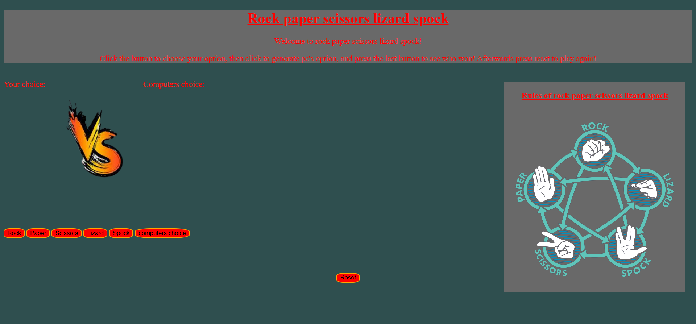

## Title: Rock paper scissors lizard Spock

To play the game: [click here](https://glinchflash.github.io/Rock-paper-scissors-lizard-spock/)

---
### preview

### Rules

* Scissors cut Paper
* Paper covers Rock
* Rock crushes Lizard
* Lizard poisons Spock
* Spock smashes Scissors
* Scissors decapitate Lizard
* Lizard eats Paper
* Paper disproves Spock
* Spock vaporizes Rock
* Rock crushes Scissors
---

### Must have features
* Buttons for each option (rock, paper, scissors, lizard, spock)
* Button to generate computers choice and decide the winner
* Let player know who won
* Have a reset button
---

### Nice-to-have features
* Nice graphics
* Let the player input using a text field
* Show what the player picked by highlighting the correct button
* Add even more options (but avoid 100 if statements)
* Add complex rules
---

#### Progress on the must-haves

 1. -[x] Implement 5 buttons (1 for each option)
    * -[x] create buttons in html
    * -[x] style buttons in css (used scss)
    * -[x] write function for buttons so users choice gets registered
 2. - [x] Button to generate computers choice and declare the winner
    * -[x] create button in html
    * -[x] style in css (used scss)
    * -[x] write function to register button clicked and generate computers choice
    * -[x] write function to declare winner
    * -[x] merge both function
 3. - [x] Let player know who won
    * - [x] write function to calculate who won (if statements)
    * - [x] make it display on screen
 4. -[x] Have a reset button
     * -[x] create button in html
     * -[x] style button in css (used scss)
     * -[x] make button clicked register
     * -[x] write function to reset the game
 ---

#### progress on Nice-To-Haves

1. Nice graphics [x]
    - [x] style buttons
   - [x] work on layout
   - [x] add images to show players choice instead of plain text
   - [x] added rules section
2. Let the player input using a text field [ ]
3. Show what the player picked by highlighting the correct button[ ]
    * -[x] Decided to use images instead of highlighting button
4. Add even more options (but avoid 100 if statements) [ ] 
5. Add complex rules  [ ]
---

#### Personal ideas

1. ask for players name and change "you win" into "*players name* wins" [x]
   * -[x] write prompt to ask for users input (players name)
   * -[x] display players name on screen
   * -[x] display players name on screen when player has won
2. Add rules section
   * -[x]  find clear images containing the rules
   *  -[x] implement rules img into rules section in html
   *  -[x] style rule section
3. Add "VS" img
    *  -[x] find nice "vs" images (based on street fighter)
    *  -[x] implement it in html
    *  -[x] style (position) "vs" image
---

### What have I learned?

1. Better understanding of If-statements
2. Better understanding of "and" (&&) / "or"(||)
3. General better understanding of the basic javascript language
4. Learning to display images with click of a button
5. How fun javascript can be
___

### Issues I came across
1. if statement was incorrect making it so the declared winner was wrong
    * if statment was to confusing so used "&&"/ "||" to make it more clear
    * figured the mistake out when if statement was more clear
2. if statement became confusing
   * started using "&&"/ "||" to fix this
3. images didn't show when choices where locked in
   * figured out I made a mistake in the link (didn't link img implementation into button click function)
___

